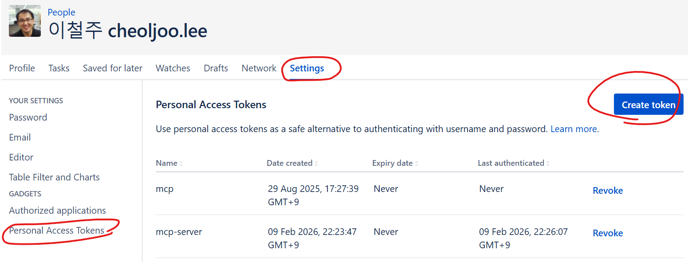

# 1. how to install
$  npm install -g @github/copilot

added 7 packages in 5s

# 2. how to run
```
$  copilot
┌──                                                                         ──┐
│                                                           ▄██████▄          │
    Welcome to GitHub                                   ▄█▀▀▀▀▀██▀▀▀▀▀█▄
    █████┐ █████┐ █████┐ ██┐██┐     █████┐ ██████┐     ▐█      ▐▌      █▌
   ██┌───┘██┌──██┐██┌─██┐██│██│    ██┌──██┐└─██┌─┘     ▐█▄    ▄██▄    ▄█▌
   ██│    ██│  ██│█████┌┘██│██│    ██│  ██│  ██│      ▄▄███████▀▀███████▄▄
   ██│    ██│  ██│██┌──┘ ██│██│    ██│  ██│  ██│     ████     ▄  ▄     ████
   └█████┐└█████┌┘██│    ██│██████┐└█████┌┘  ██│     ████     █  █     ████
    └────┘ └────┘ └─┘    └─┘└─────┘ └────┘   └─┘     ▀███▄            ▄███▀
│                              CLI Version 0.0.373      ▀▀████████████▀▀      │
└──                                                                         ──┘
 Version 0.0.373 · Commit 1f9ed04

 Copilot can write, test and debug code right from your terminal. Describe a task to get started or enter ? for help. Copilot uses AI, check for mistakes.

 ● Folder /home/cheoljoo.lee/code/ticketsage has been added to trusted folders.

 ● Added key bindings Shift+Enter and Ctrl+Enter for VS Code successfully.

 Please use /login to sign in to use Copilot
 ~/code/ticketsage[⎇ main*]
 ───────────────────────────────────────────────────────────────────────────────────────────────────────────────────────────────────────────────────────────────────────────────────────────────────
 >  Enter @ to mention files or / for commands
 ```

 ## 2.1. login
 - /login
    - brower login and put the value


## 2.2. mcp (jira, confluence))
- configuration in linux : ```$  cat /data01/cheoljoo.lee/.copilot/mcp-config.json```
  - ```python
    {
      "mcpServers": {
        "jira": {
          "command": "uvx",
          "args": [
            "mcp-atlassian"
          ],
          "env": {
            "JIRA_URL": "http://jira.lge.com/issue",
            "JIRA_PERSONAL_TOKEN": "your_token_here",
            "CONFLUENCE_URL": "http://collab.lge.com/main",
            "CONFLUENCE_PERSONAL_TOKEN": "your_token_here",
            "MCP_VERBOSE": "true"
          }
        }
      }
    }
    ```

- JIRA_PERSONAL_TOKEN : 자산의 icon -> Profile 선택
  - 
  - token 생성
    - 
- CONFLUENCE_PERSONAL_TOKEN : 동일
  - 
  - token 생성
    - 
으로 실행을 시키면 된다.

- copilot 실행을 시키면 된다. (```$ copilot```)
  - token을 아끼기 위해서는 /model 로 변경

- jira 연결 잘 될때 , 
  - prompt❯ get details for Jira ticket AGILEDEV-653
    - ```txt
      ◐ The user wants to get details for a Jira ticket AGILEDEV-653. I should use the jira-jira_get_issue tool to retrieve this information.

        I need to call the jira-jira_get_issue tool with the issue_key parameter set to "AGILEDEV-653". I'll use the default fields to get essential information.

        I should also report my intent as I'm about to make a tool call.

      ● Get Issue
        └ {"result":"{\n  \"id\": \"10406458\",\n  \"key\": \"AGILEDEV-653\",\n  \"summ...

      ● AGILEDEV-653 - [ticket sage][train] LLM 접속 에러가 반복적으로 일어날때, 이에 대한 처리 (에러가 많이 일어난 것을 모아서 다음 날에 다시 처리) -> 처리 안된 것들은 mail 전송

        Status: Open (To Do)
        Priority: P2
        Assignee: 이철주 cheoljoo.lee (cheoljoo.lee@lge.com (mailto:cheoljoo.lee@lge.com))
        Reporter: 이철주 cheoljoo.lee
        Created: 2025-11-26
        Last Updated: 2026-02-05
      ```


- confluence 연결 잘 될때
  - prompt❯ confluence에서 mcp 관련 글을 찾아주세요.
    - ```txt
      ◐ 사용자가 Confluence에서 "mcp" 관련 글을 찾아달라고 요청했습니다. Confluence 검색 기능을 사용해야 합니다.

        jira-confluence_search 도구를 사용하여 "mcp"를 검색하면 됩니다. 간단한 텍스트 검색으로 시작하겠습니다.

        먼저 report_intent를 호출하고, 그 다음 confluence_search를 호출해야 합니다.

      ● Search Content
        └ {"result":"[\n  {\n    \"id\": \"3542794331\",\n    \"title\": \"[26.02.09] M...

      ● Confluence에서 MCP 관련 글 10개를 찾았습니다:

        1. [26.02.09] MCP tool 현황 정리 및 공유 - MCP 서버 등록 및 Agent verify lab 관련
        2. 5.13.2.2.3 MCP - MCP 프로토콜 배경과 LLM 연관성 설명
        3. MCP 사용기 - mcp-atlassian - mcp-atlassian 설정 및 사용 경험
        4. mcp server setup - VS Code, GitHub Copilot, Node.js 등 사전 준비사항
        5. (Eng) [MCP] Setting MCP Server - AISE와 AI Agent 통합 가이드
        6. [SAVE] MCP 서버 사용 가이드 - save-mcp 설정 및 토큰 인증 가이드
        7. 🌱 MCP - MCP와 FastMCP 기술 개요 및 구성 요소
        8. MCP server - MCP 관련 참고 링크 모음
        9. MCP-server - VS Code에서 MCP 추가 및 설정 방법
        10. 3. MCP (Model Context Protocol) - Claude Code와 MCP 연동 가이드

        전체적으로 MCP 서버 설정, 사용 가이드, 기술 개요 등 다양한 내용이 있습니다.
      ```

### 2.2.1. trouble shooting
- jira 연결 잘 안될때 
  - prompt❯ get details for Jira ticket AGILEDEV-653
    - ```txt
      ✗ Get Issue
        Error calling tool 'get_issue': 404 Client Error: Not Found for url: http://jira.lge.com/rest/api/2/issue/AGILEDEV-653?fields=updated,created,reporter,summary,description,labels,priority,assignee,status,issuetype&updateHistory=true (
        http://jira.lge.com/rest/api/2/issue/AGILEDEV-653?fields=updated,created,reporter,summary,description,labels,priority,assignee,status,issuetype&updateHistory=true)

      ● The Jira ticket AGILEDEV-653 was not found (404 error). This could mean:

        - The ticket doesn't exist
        - The ticket key is incorrect
        - You don't have permission to view it

        Would you like me to search for similar tickets or verify the ticket key?
      ```

와 같이 나온다. 우리 jira.lge.com 에서 앞에 issue가 더 붙어야 함을 알수 있다.
- http://jira.lge.com/rest/api/2/issue/AGILEDEV-653 ==> http://jira.lge.com/issue/rest/api/2/issue/AGILEDEV-653


# 3. mcp (gerrit)
- copilot에서 요청할 prompt
  - prompt
    - https://github.com/cayirtepeomer/gerrit-code-review-mcp 을 이용하여 gerrit 관련 MCP도 설치하고 사용하고 싶습니다. uv를 사용해주세요.
      - 뒤의 uv를 사용하라는 것을 하지 않아도 됨.  그러나, 제 linux account에서는 pip 등이 문제가 있어 uvx로 처리하고 해결됨.
    - 설치 완료 요약
      - ```txt
        ✅ Gerrit MCP 서버 설치 완료

        - Repository: https://github.com/cayirtepeomer/gerrit-code-review-mcp (https://github.com/cayirtepeomer/gerrit-code-review-mcp)
        - 위치: /data01/cheoljoo.lee/code/mcp_copilot/gerrit-code-review-mcp
        - 의존성: uv sync로 모든 패키지 설치 완료

        ✅ MCP 설정 완료

        - 설정 파일: ~/.copilot/mcp-config.json
        - Gerrit 서버: vgit.lge.com
        - 사용자: cheoljoo.lee

        다음 단계:

        1. Copilot CLI 재시작: copilot
        2. Gerrit 기능 사용 예시:
          - Gerrit에서 나에게 할당된 모든 리뷰 찾기
          - Gerrit change 12345의 상세 정보 보기
          - Gerrit patchset 1과 3 비교하기
          - Gerrit change에 리뷰 코멘트 남기기
        3. 로그 확인 (문제 발생 시): tail -f ~/.copilot/logs/mcp-*.log
        ```
    - mcp-config.json
      - ```python
        {
          "mcpServers": {
            "jira": {
              "command": "uvx",
              "args": [
                "mcp-atlassian"
              ],
              "env": {
                "JIRA_URL": "http://jira.lge.com/issue",
                "JIRA_PERSONAL_TOKEN": "your_token_here",
                "CONFLUENCE_URL": "http://collab.lge.com/main",
                "CONFLUENCE_PERSONAL_TOKEN": "your_token_here",
                "MCP_VERBOSE": "true"
              }
            },
            "gerrit": {
              "command": "/data01/cheoljoo.lee/code/mcp_copilot/gerrit-code-review-mcp/.venv/bin/python",
              "args": [
                "/data01/cheoljoo.lee/code/mcp_copilot/gerrit-code-review-mcp/server.py",
                "--transport",
                "stdio"
              ],
              "cwd": "/data01/cheoljoo.lee/code/mcp_copilot/gerrit-code-review-mcp",
              "env": {
                "PYTHONPATH": "/data01/cheoljoo.lee/code/mcp_copilot/gerrit-code-review-mcp",
                "VIRTUAL_ENV": "/data01/cheoljoo.lee/code/mcp_copilot/gerrit-code-review-mcp/.venv",
                "PATH": "/data01/cheoljoo.lee/code/mcp_copilot/gerrit-code-review-mcp/.venv/bin:/usr/local/bin:/usr/bin:/bin",
                "GERRIT_HOST": "vgit.lge.com",
                "GERRIT_USER": "your_id",
                "GERRIT_HTTP_PASSWORD": "your_passwd",
                "GERRIT_SSL_VERIFY": "false"
              }
            }
          }
        }
        ```
  - prompt> gerrit 정보는 다음과 같다. 저장해두고 사용할수 있게 해 달라.
    - pvs_crawler/SWPMUtil/global_variables.py 안에서 gerrit_conf_dict  정보를 copy & paste하여 copilot에게 알려주면 알아서 원하는 정보들을 얻어와줌
    - 예) 이것은 curl로 해결하는 것이다. 
      - ```txt
        ❯ gerrit as에서 cheoljoo.lee 의 commit 이 있는지 살펴봐주세요.

        ● Check for cheoljoo.lee's commits in as gerrit
          $ curl -s -u "vspvs:BsZGxmejS3Ucec0sHvnwlZAAVX4LQNr8kOSxYAwaHQ" "http://vgit.lge.com/as/a/changes/?q=owner:cheoljoo.lee&n=5" 2>&1 | sed '1d' | python3 -c "import sys, json; data=json.load(sys.stdin); print(f'총 {len(data)}개 커밋\n'); [print(f'{i+1}. [{d[\"_number\"]}] {d[\"subject\"]}\n   프로젝트: 
          {d[\"project\"]}\n   브랜치: {d[\"branch\"]}\n   업데이트: {d[\"updated\"]}\n   URL: http://vgit.lge.com/as/c/{d[\"_number\"]}\n') for i, d in enumerate(data)]" 2>/dev/null
          └ 8 lines...

        ● gerrit as 서버에서 cheoljoo.lee가 작성한 커밋이 1건 있습니다.

        URL: http://vgit.lge.com/as/c/2142535 (http://vgit.lge.com/as/c/2142535)
        ```

먼저 내 DB에 대한 MCP를 먼저 만들어봐야 할 듯
gerrit를 위한 gerrit-code-review-mcp 소스를 분석해서 변경해야 할 듯
